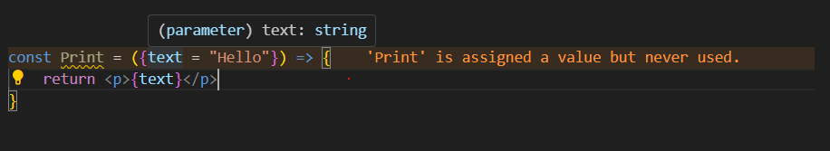
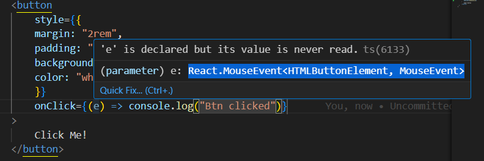

# TS-Learnings

## Benefits of having TS:

### TSERR: Type 'number' is not assignable to type 'string'
```
let companyName = "Google";
   companyName = 100;
```


### TSERR: Parameter 'num1' implicitly has an 'any' type
```
function add(num1, num2){ //
}
```

### TSERR: A function whose declared type is neither 'undefined', 'void', nor 'any' must return a value
```
function add(num1: number, num2: number): number {
    let res = num1 + num2;
}
```

### TSERR: Expected 2 arguments, but got 1. An argument for 'num2' was not provided.
`add("abc")`

### TSERR: Argument of type 'string' is not assignable to parameter of type 'number'.
### TSERR: Property 'label' is missing in type '{}' but required in type '{ label: any; }'.
`<PrintText />`

### TSERR: Binding element 'label' implicitly has an 'any' type.
 ```
 const PrintText = ({label}) => {
    // some code
    }
```

## Typing Props in React

So in react, props is an object and we destructure the keys from this props object.
Hence our type is also going to be an object as described below

A key containing `key?: value` in a prop of our type is an optional type even if you don't pass, TS wont throw an error

```
function PrintText({label, isShown = false} : {
    label: string,
    isShown?: false
}) => {}
```

So in cases, where we have numerous no. of props instead of having type checking as above syntax, we can have a clear concise one with `type` or `interface`

```
type PrintTextProps = {
    label: string,
    isShown?: boolean
}

const PrintText = ({label, isShown = false} : PrintTextProps) => {}
```

## Complete code used for demonstration below:
```
import React from 'react'

// type ButtonProps = {
//   style: React.CSSProperties,
//   borderRadius: {
//     topLeft: number,
//     topRight: number,
//     bottomLeft: number,
//     bottomRight: number
//   }
// }

// DOCS: The above type could be re-written as below as well:
// Record<string, number> => string => is the type of key in this object, and number is the type of value on this object
// Ref readme for more

type ButtonProps = {
    style: React.CSSProperties,
    borderRadius: Record<string, number>,
    // onClick: () => void, // DOCS: Function without any params and doesn't return anything
    onClick: (testNum: string) => number,
    children: React.ReactNode, // DOCS: Accepts everything as children like string, JSX Element, boolean, num etc.
    // children: JSX.Element // DOCS: Accepts only JSX element <div></div>
    setCount: React.Dispatch<React.SetStateAction<number>>
    isPillType?: boolean,
  }


const Button_5 = ({style, borderRadius, onClick, children, setCount, isPillType = false}: ButtonProps) => {

  const {topLeft, topRight, bottomLeft, bottomRight} = borderRadius;

  const clickHandler = () => {
    onClick("5");
    setCount((prevCount) => prevCount+1);
  }

  return (
    <>
        <button
            style={{...style, borderRadius: `${topLeft}px ${topRight}px ${bottomRight}px ${bottomLeft}px` }} onClick={clickHandler}>
            {children}
        </button>
        <Print />
    </>
  )
}

export default Button_5;


const Print = ({text = "Hello"}) => {
    return <p>{text}</p>
}
```

### TSERR: Property 'toUppercase' does not exist on type 'number'.
- When we try to access any predefined methods on array/string/obj/number, TS checks if the method used is allowed for this particular data type

```
type ButtonProps = {
    label: string,
    isPillType?: boolean,
    padding: number[],
    margin: [number,string],
    background: string,
    color: string,
    fontSize: number
}

let b = fontSize.toUppercase(); // Property 'toUppercase' does not exist on type 'number'
```

### Two pole type in TS:

- When we want to specify the length of the array and/or specify types for different elements of array, then we can use two pole.
- `margin: [number,string]`
- This allows only elements on this array with 1st element being a number and 2nd should be a string


## Specific Object Structure typing VS Generic typing

```
<!-- Specific -->
type ButtonProps = {
  style: React.CSSProperties,
  borderRadius: {
    topLeft: number,
    topRight: number,
    bottomLeft: number,
    bottomRight: number
  }
}

<!-- Generic -->
type ButtonProps = {
    style: React.CSSProperties,
    borderRadius: Record<string, number>,
    // onClick: () => void,
    onClick: (testNum: string) => number,
  }
```
1. Specific Object Structure:
The first type explicitly defines the structure of the borderRadius object with four specific properties (topLeft, topRight, bottomLeft, bottomRight) each having a number type. This approach provides clarity and strictness about the expected properties and their types.

2. Generalized Object Structure:
The second type (Record<string, number>) defines a more generalized structure for borderRadius. It allows any number of properties (keys) as strings with corresponding values as numbers. This approach is more flexible, allowing for a varying number of properties in the borderRadius object.

When we want to enforce that structure, the first type is more suitable as it explicitly defines those properties.
If we need flexibility and anticipate the possibility of additional or dynamic properties for borderRadius, the second type (Record<string, number>) is more appropriate as it allows for a more generic object structure.

## Passing functions as params:

```
type ButtonProps = {
    style: React.CSSProperties,
    borderRadius: Record<string, number>,
    // onClick: () => void,
    onClick: (testNum: string) => number,
}
```

- When the function doesn't have any parameter and doesn't return anything then, we can type the same as `onClick: () => void`

- Function having a/some params and returning a value can be typed as `onClick: (testNum: string) => number`

## Typing children prop:

```
type ButtonProps = {
    style: React.CSSProperties,
    borderRadius: Record<string, number>,
    onClick: (testNum: string) => number,
    children: React.ReactNode
  }
```

- When we type the `React.ReactNode`, this accepts a string, html element, boolean, it could be anything. All the below snippets are valid.

```
    <Button>Click me</Button>
    <Button>{true}</Button>
    <Button>
        <icon>I</icon>
    </Button>
```


## To have strict check to allow only JSX element,

```
type ButtonProps = {
    children: JSX.Element
  }
```

### TSERR: TS2747: 'Button5' components don't accept text as child elements. Text in JSX has the type 'string', but the expected type of 'children' is 'Element'.
```
**NOT ALLOWED**
<Button>Click me</Button>
```

```
**ALLOWED**
    <Button>
        <div>
            <span></span>
        </div>
    </Button>
```

## Typing Default Params:
- For components with default params, TS infers the type automatically.
- Hence we don't have to explicitly type



## Interface VS Type
- Interface can only define objects, our type of data structures can't be described with interface.

```
interface ButtonProps {
    style: React.CSSProperties,
    borderRadius: Record<string, number>,
    // onClick: () => void, // DOCS: Function without any params and doesn't return anything
    onClick: (testNum: string) => number,
    children: React.ReactNode, // DOCS: Accepts everything as children like string, JSX Element, boolean, num etc.
    // children: JSX.Element // DOCS: Accepts only JSX element <div></div>
    setCount: React.Dispatch<React.SetStateAction<number>>
    isPillType?: boolean,
  }
```

- Describing strings like below isn't possible.
```
type Color = "red" | "blue" | "white" | "purple"
const color: Color = "purple";
```

- This has to be an object if it has to be described by interface.
```
interface Color {
     color: "red" | "blue" | "white" | "purple"
}
```
## Typing component attributes:

React.ComponentProps => would accept all the attributes of  buttton element and it also accepts a `ref={ref}` being forwarded from parent.
```
type ButtonProps = React.ComponentProps<"button">;
```

- To accept only the attributes without ref,
```
type ButtonProps = React.ComponentPropsWithoutRef<"button">;
```

- To accept ref and attributes:
```
type ButtonProps = React.ComponentPropsWithRef<"button">;
```

It's better to specify with or without Ref explicitly.

## Intersecting types and interfaces

```
type ButtonProps = React.ComponentPropsWithoutRef<"button"> & {
  variant?: "primary" | "secondary"
}
```
In interface we use `extends` to intersect

```
interface ButtonProps extends React.ComponentPropsWithoutRef<"button"> {
  variant?: "primary" | "secondary"
}
```
## Typing events:

For event handlers like onClick/onChange etc, we can attach type to the event if not known by hovering over the event on the callback function, TS infers the actual event type and gives us as below:



### onClick Events:
```
const handleClick = (e: React.MouseEvent<HTMLButtonElement, MouseEvent>) => {
        console.log("btn clciked")
    }

<button onClick={handleClick}></button>/
```
### onChange Events:

```
<input value={enteredText} onChange={textInputHandler}/>

const textInputHandler = (e: React.ChangeEvent<HTMLInputElement>) => {
        setTextToPrint("");
        setEnteredText(e.target.value)
    }

```

## Typing react hooks:

### useState:
For the primitive values, TS infers the type by itself hence we need not explicitly provide it

```
<!-- Not necessary to do: -->
const [count, setCount] = useState<number>(0);

<!-- Fine to do -->
const [count, setCount] = useState(0);
```

For the object or an array,
```
const [user,setUser] = useState<User | null>(null);

const name = user?.name;
```

### useRef:

For useRef which holds a mutable Html Element,
```
const btnRef = useRef<HTMLButtonElement | null>(null);
```

The only other hook that needs a typing, is useContext API

### useContext:

TODO: Need to add this over